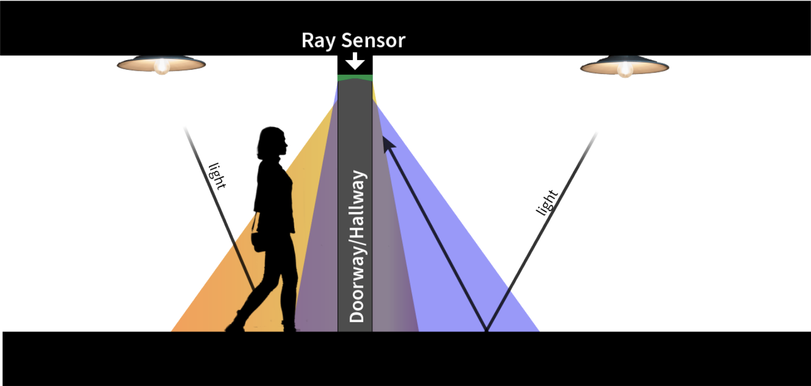

# Ray Sensor Documentation Notes

Ray is a batteryless, doorframe/passageway-mounted room-level occupancy monitoring sensor that uses changes in indoor ambient light reflections to detect people entering and exiting a room or hallway and estimate their direction of travel.


<table style="width: 100%; border-collapse: collapse;">
  <tr>
    <td style="width: 100%; text-align: center;">
      
      <br>
      <strong>Ray Use Scenario/Concept</strong>
    </td>
  </tr>
</table>


In this document, we provide the abstract of the work with highlights from our experiments, comments for the JSys reviewers, a layout of the folder/file structure, and instructions on how to build a Ray sensor and set it and a base station up for deployment.

# Abstract
Room-level occupancy-tracking systems enable intelligent control of building functions like air conditioning and power delivery to adapt to the needs of their occupants. Unfortunately, existing occupancy-tracking systems are bulky, have short battery lifetimes, are not privacy-preserving, or only provide coarse-grain occupancy information. Furthermore, retrofitting existing infrastructure with wired sensors is prohibitively expensive.

In this paper, we present Ray, a batteryless, doorframe/passageway-mounted room-level occupancy monitoring sensor that uses changes in indoor ambient light reflections to detect people entering and exiting a room or hallway and estimate direction of travel. We evaluated Ray in mixed lighting conditions on both sides of the doorway in an office-style setting, using subjects with a wide variety of physical characteristics. We conducted 881 controlled experiments in 7 doorways with 9 individuals and achieved a total detection accuracy of 100% and movement direction accuracy averaging 96.4%. Furthermore, we deployed Ray sensors for 64 days in 5 locations, comparing them with a commercial batteryless occupancy sensor. Ray outperformed the commercial sensor, particularly where traffic is moderate to heavy. Ray demonstrates that ambient light reflections provide both a promising low-cost, long-term sustainable option for monitoring how people use buildings and an exciting new research direction for batteryless computing.

# Artifact Evaluation - For JSys Reviewers
The artifacts associated with this paper consist of both hardware and software for building a functioning deployment of the Ray sensor.

We are including the custom PCB designs, Bill of Materials, and 3D prototype housing files used to create a Ray sensor. PDFs of the schematic and Design files are also included for reviewer convenience. Software for training and the firmware that runs the Ray sensor and base station are also provided. Documentation includes how to build, set up, tune, train, and deploy a Ray sensor as well as how to set up a base station for receiving the sensor data.

As the claims of this work are of the effectiveness of our custom Ray sensor, it is hard to automate items for testing and evaluation without actually having a physical sensor built, trained, and deployed for reviewers to test. After speaking with the chair of the Artifact Evaluation Board, we determined the best way to demonstrate the usability and reproducibility of this work is by providing the design files (raw and as PDFs for convenience), and making several demonstration videos to show the system working in controlled scenarios, in the presence of confounding cases, and when comparing to a commercial occupancy sensor. We hope they allow enough insight to judge the effectiveness, claims, and reproducibility of the work as it is hard to exactly recreate some of these experiments as they were gathered from live individuals walking through passageways.

# Folder/File Layout
This repo stores code, hardware files, and other technical documents for the project. Subdirectories are described below:

## Hardware
This folder contains all of the custom PCB Eagle design files (PDFs of the schematic and board design files are also included for reviewer convenience), Bill of Materials (BOM), and 3D prototype housing/enclosures files used to create a Ray sensor.

## Software
All software provided is either C code compiled and run on the MSP430FR5994 chips used for our sensor and base station or Python3 scripting code that is processed on a base station or laptop. Because there are variations in component quality and in doorway and lighting conditions, users want to train the classifier model on data more closely related to the test environment to improve accuracy. In that event, The following subfolders contain the code needed to gather the raw features from a Ray sensor (0_Get_Features) and train a new decision tree classifier model using those features (1_Train_Model). Once trained, the model will need to be manually implemented in the experiment code subfolders 2_Controlled_Studies and 3_Uncontrolled_Studies (specific locations to change are mentioned in those folders' ReadMe documentation.

### 0_Get_Features
This folder contains the firmware needed for both the Ray sensor and for a base station in order to gather the raw feature data that the sensor is collecting on a doorway/passageway that you wish to train your classification model for capturing direction and various confounding, yet common, cases such as pass-by events. Have sample subjects walk in and out in a controlled manner to capture what the raw features from the sensor look like under local lighting conditions and environment. Collect this data using what is received at the base station and the result for that data that you wish to train with in a CSV file for use in training the model in the next step.

### 1_Train_Model
This folder contains a python script called makedecisions.py that will use the CSV file of data gathered from the 0_Get_Features scripts/code in order to train a new decision tree to update the models for testing or real world deployment.

### 2_Controlled_Studies
This folder contains the firmware for both the Ray sensor and for a base station to receive packets from a Ray Sensor using the CC1101 Radio with a MSP430FR994 LaunchPad where the Ray Sensor sends a single packet for individual controlled events.

### 3_Uncontrolled_Studies
This folder contains the firmware for both the Ray sensor and for a base station to receive full packets from a deployed Ray Sensor using the CC1101 Radio with a MSP430FR994 LaunchPad where the Ray Sensor to send complete packets containing a sequence of 5 events, an estimate of their time between events, heartbeats in the absence of activity for 2 minutes, and history of the last two packets sent for redundancy.

## Video_Demos
We also provide video demonstrations of the Ray sensor operating during a range of activities. These include people walking through doorways under the sensor, pass-by events where a person walks near the sensor but does not pass under it, and confounding cases like lingering and many people walking in a tight group. We also demonstrate a comparison between the Ray sensor and the commercially available EnOcean sensor (a batteryless PIR-based occupancy sensor), showing that Ray is able to more accurately estimate the number of people during higher traffic conditions.   


# Building a Ray Sensor

In this section, we describe the steps it takes to build a physical Ray Sensor for deployment.

<table style="width: 150%; border-collapse: collapse;">
  <tr>
    <td style="width: 50%; text-align: center;">
      
      <br>
      <strong>Ray PCB Close Up</strong>
    </td>
    <td style="width: 100%; text-align: center;">
      
      <br>
      <strong>Ray Full Sensor</strong>
    </td>
  </tr>
</table>

## Housing/Enclosure, Parts, and Assembly
Our prototype hardware integrates a modular custom printed circuit board (PCB) housed in a 3D-printed plastic enclosure, four solar panels, and a TI CC1101 radio.

### Custom PCB
The PCB for the Ray sensor consists of three modular parts: a Solar_Module, a MCU_Module, and a Radio_Module. All design files for these modules and the Bill of Materials for all necessary PCB components can be found in the Hardware/PCB_Designs/ folder. Boards can be fabricated at many places online, such as OSHpark etc, and the components can be populated by hand or by a manufacturer as well. Design files can be viewed directly by a program like Eagle, but PDFs have been made available for convenience of viewing. The Solar_Module attaches to the MCU_Module and the MCU_Module attaches to the Radio_Module.

### 3D Enclosure
The 3D printed mounting system is made of PLA plastic and contains the PCB, solar cells, and necessary wiring connecting them. Enclosure designs to house the PCB and attach the solar panels to can be found in Hardware/3D_Enclosure/PCB_Housing_and_20_DegBody_Assembly.stl with a second file Hardware/3D_Enclosure/PCB_Housing_Cap.stl to make a cap to cover the PCB during deployment. The enclosure provides a nesting place for the solar cells, which angles the solar cell slots such that two of the four of the solar cells are pointed toward the entry, while the rest are pointed toward the exit.


### Connecting Solar Panels
Four solar panels need to be attached to the enclosure, where they will be divided into two sets of two panels each, one facing inward (the direction the radio antenna is pointing) and one set facing outward. The inward set of solar panels are connected in series and connected to the SOLAR1 terminal of the Solar Module PCB. The outward facing panels are also connected in series and then added to the SOLAR2 terminal.

### Tune the Detectors
Ray uses a detection circuit to determine when to wake up the microcontroller to assess the possible event. The detector circuitry is tunable using trim potentiometers (trim pots) pre-installation in deployment. Testers may find that, depending on the lighting conditions of a particular doorway, the sensitivity of the detector circuit's trim pots may need adjusting. We found in our experiments that we did need to adjust the trim pots some for the general lighting conditions and found that they generally worked for other similar lighting conditions without needing to be readjusted for every doorway. Using a screwdriver on TM1 for monitoring SOLAR1 or TM2 for monitoring SOLAR2 from the Solar_Module PCB schematics, turning to one direction will move the detection threshold and make the detectors more sensitive while turning in the opposite direction will make them less sensitive.

### Attaching a Radio
The Ray PCB also uses a TI CC1101 radio for communication that is to be connected to the Radio_Module in Hardware/PCB_Designs/. The TI CC1101 radio board is an off-the-shelf board that we designed a plug-in for on the Radio_Module boards. For our purposes, we considered the direction the antenna was pointing to be inward when mounting the sensor for practice, but one could train and adjust the code if pointing the other direction is preferred.

### Installing on a doorway
With all the parts assembled, tuned, connected, and attached to the 3D printed enclosure, the Ray sensor can be attached to the top of a doorway/passageway frame with solar panels facing down any preferred orientation. For our experiments, we affixed the 3D enclosure to a piece of wood with magnets screwed to the other side for ease in attaching and removing the sensor on different doorway/passageway frames, as most within our office building had metal frames or structures.

## Setting up a Base Station
To receive the data packets from the Ray Sensor, you will need a MSP430FR5994 LaunchPad and another off-the-shelf CC1101 Radio.  The radio will need to be connected to the LaunchPad’s pins as follows:
```
	*MSP430FR5994*	←    *CC1101*
		VCC	←	VCC
	 	GND	←	GND
	 	P3.4	←	GDO0
	 	P3.6	←	GDO2
	 	P4.3  	←	CSN
	 	P5.0  	←	MOSI
	 	P5.1 	←	MISO
	 	P5.2  	←	SCK 
```
And as documented in the top comment of each basestation_receive.c code in the folders containing base station code. If these pins need to be modified for a particular setup, there is an /includes/pins.h file in each folder containing base station code that can be easily modified.  Once attached, the base station firmware will need to be installed to the LaunchPad simply by connecting the LaunchPad by USB to a computer with msp-gcc installed.  Navigate to the firmware folder of interest, update the makefile as suggested in that folder’s readme, and then simply run “make install” to install the firmware on the LaunchPad.   Data can be gathered by simply reading off what is sent over serial or by using a script that grabs what is coming across from the LaunchPad over serial to a database.

## Training the event classification model
### Gather Raw Feature Data
0_Get_Features folder in software Needs work **************


### Train Model
Need python3 pandas, graphviz, and scikit-learn installed before running the training model script. Needs work **************


### Translate Decision Tree Diagram to Implementation**
Now that you have a tree generated, you will need to manually implement that in the code. Needs work **************

### Installing Firmware
The Ray firmware is designed to be ultra-low power, even in active mode, and has low computational complexity, offloading the bulk of the detection to the hardware circuits. All firmware code in the Software folder basically requires the same setup in order to program either the launchpad or the Ray Sensor.
1. Change the SUPPORT_FILE_DIRECTORY in the makefile to your msp430 gcc include
   path.
2. Hook up a MSP430FR5994 LaunchPad to your computer.
3. Connect the sensor to the Programmer pins on the LaunchPad (some jumpers may need to be removed to accomplish this) and plug them in to the appropriate programming pins on the MCU_Module.
4. Use "make install" to load the program into your device.
5. Detach from the programmer and reconnect the PCB in the enclosure and the unit is ready to be deployed. (Skip steps 3 and 5 if programming a MSP430 LaunchPad for a base station)


