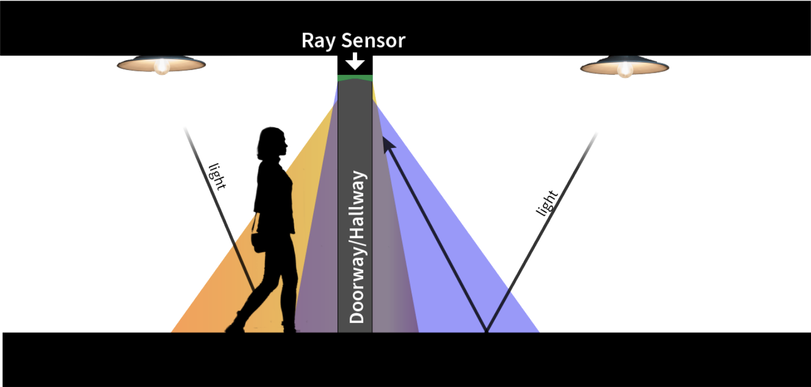

# Ray Sensor Documentation Notes

Ray is a batteryless, doorframe/passageway-mounted room-level occupancy monitoring sensor that uses changes in indoor ambient light reflections to detect people entering and exiting a room or hallway and estimate their direction of travel.  

<table style="width: 100%; border-collapse: collapse;">
  <tr>
    <td style="width: 50%; text-align: center;">
      
       
      <strong>Ray Use Scenario/Concept</strong>
    </td>
  </tr>
</table>

In this document, we provide the abstract of the work with highlights from our experiments, comments for the JSys reviewers, a layout of the folder/file structure, and instructions on how to build a Ray sensor and set it and a base station up for deployment.

# Abstract
Room-level occupancy-tracking systems enable intelligent control of building functions like air conditioning and power delivery to adapt to the needs of their occupants. Unfortunately, existing occupancy-tracking systems are bulky, have short battery lifetimes, are not privacy-preserving, or only provide coarse-grain occupancy information. Furthermore, retrofitting existing infrastructures with wired sensors is prohibitively expensive.

In this paper, we present **Ray, a batteryless, doorframe/passageway-mounted room-level occupancy monitoring sensor** that uses changes in indoor ambient light reflections to detect people entering and exiting a room or hallway and estimate direction of travel. We evaluated Ray in mixed lighting conditions on both sides of the doorway in an office-style setting, using subjects with a wide variety of physical characteristics. We conducted 881 controlled experiments in 7 doorways with 9 individuals and achieved a total detection accuracy of 100\% and movement direction accuracy averaging 96.4\%. Furthermore, we deployed Ray sensors for 64 days in 5 locations, comparing them with a commercial batteryless occupancy sensor. Ray outperformed the commercial sensor, particularly where traffic is moderate to heavy. Ray demonstrates that ambient light reflections provide both a promising low-cost, long-term sustainable option for monitoring how people use buildings and an exciting new research direction for batteryless computing.

# Artifact Evaluation - For JSys Reviewers
The artifacts associated with this paper consist of both hardware and software for building a functioning deployment of the Ray sensor. 

We are including the custom PCB designs, Bill of Materials, and 3D prototype housing files used to create a Ray sensor. PDFs of the schematic and Design files are also included for reviewer convenience. Software for training and the firmware that runs the Ray sensor and base station are also provided. Documentation includes both how to build, set up, tune, train, and deploy a Ray sensor as well as how to set up a base station for receiving the sensor data.

As the claims of this work are of the effectiveness of our custom Ray sensor, it is hard to automate items for testing and evaluation without actually having a physical sensor built, trained, and deployed for you to test yourselves.  After speaking with the chair of the Artifact Evaluation Board, we determined the best way to show you that the usability and reproducibility of this work by providing the design files (raw and as pdfs for convenience) and making several demo videos to show the system working in both controlled demos, in the presence of confounding cases, and when comparing to a commercial occupancy sensor.  We hope they allow you enough insight to judge the effectiveness, claims, and reproducibility of the work as it is hard to exactly recreate some of these experiments as they were gathered from live individuals walking through passageways.

# Folder/File Layout
This repo stores code, hardware files, and other technical documents for the project. Subdirectories are described below.

## Hardware
This folder contains all of the custom PCB Eagle design files (PDFs of the schematic and board design files are also included for reviewer convenience), Bill of Materials (BOM), and 3D prototype housing/enclosures files used to create a Ray sensor. 

### 3D_Enclosure

### PCB_Designs

## Software
The Ray firmware implements the detection algorithm with a trained decision tree for event classification discussed in Section 3. Monitoring the interrupts from the detectors and deducing the direction of motion upon triggering are the main tasks of the system. The firmware is designed to be ultra-low power, even in active mode, and has low computational complexity, offloading the bulk of the detection to the hardware circuits. The Ray firmware is composed of 691 lines of commented C code, compiling to a 4459 byte image. This code size comprises only 1.7\% of the available code space on the MSP430FR5994 (256KB), leaving ample room for implementing custom tasks, recognizers, or multiprogramming operating systems.

### 0_Get_Features
 - Base Station Firmware
 - Ray Sensor Firmware

### 1_Train_Model

### 2_Controlled_Studies
 - Base Station Firmware
 - Ray Sensor Firmware
### 3_Uncontrolled_Studies
 - Base Station Firmware
 - Ray Sensor Firmware

## Video_Demos

words

# Deploying a Ray Sensor

words

## Building a Ray Sensor

### Housing/Enclosure, Parts, and Assembly
Our prototype hardware integrates a modular custom printed circuit board (PCB) housed in a 3D-printed plastic enclosure, four solar panels, and a TI CC1101 radio.

**Custom PCB**
The PCB for the Ray sensor consists of 3 modular parts, a Solar_Module, a MCU_Module, and a Radio_Module.  All design files for these modules and the Bill of Materials for all necessary PCB components can be found in the Hardware/PCB_Designs/ folder.  Boards can be fabricated at many places online, such as OSHpark etc, and the components can be populated by hand or by a manufacture as well.  Design files can be viewed directly by a program like Eagle, but PDFs have been made available for convenience of viewing.

**3D Enclosure**
The 3D printed mounting system is made of PLA plastic and contains the PCB, solar cells, and necessary wiring connecting them. Enclosure designs to house the PCB and attach the solar panels to can be found in Hardware/3D_Enclosure/PCB_Housing_and_20_DegBody_Assembly.stl with a second file Hardware/3D_Enclosure/PCB_Housing_Cap.stl to make a cap to cover the PCB during deployment.  The enclosure provides a nesting place for the solar cells, which angles the solar cell slots such that 2 of the 4 of the solar cells are pointed toward the entry, while the rest are pointed toward the exit.  

**Connecting Solar Panels**
The four (4) RL-55x70 solar panels need to be attached to the enclosure where they will be divided into two sets of two panels each, one facing inward (the direction the radio antenna is pointing) and one set facing outward.  The inward set of solar panels are connected in series and connected to the SOLAR1 terminal of the Solar Module PCB.  The outward facing panels are also connected in series and then added to the SOLAR2 terminal.

**Tune the Detectors**

The detector circuitry is made using nano-power comparators (TI TLV3691) and a passive RC filter network. In order to give us flexibility, the RC filter network is tunable using trim potentiometers pre-installation or digital potentiometers in deployment. The Ray PCB also has a TI CC1101 radio for communication that is to be connected to the Radio_Module in Hardware/PCB_Designs/. 

Ray uses a detection circuit that wakes up the microcontroller

### Training the event classification model

### Installing Firmware
The Ray firmware implements the detection algorithm with a trained decision tree for event classification discussed in Section 3. Monitoring the interrupts from the detectors and deducing the direction of motion upon triggering are the main tasks of the system. The firmware is designed to be ultra-low power, even in active mode, and has low computational complexity, offloading the bulk of the detection to the hardware circuits. The Ray firmware is composed of 691 lines of commented C code, compiling to a 4459 byte image. This code size comprises only 1.7\% of the available code space on the MSP430FR5994 (256KB), leaving ample room for implementing custom tasks, recognizers, or multiprogramming operating systems.

### Installing on a doorway

## Setting up a Base Station

### Parts and Assembly
### Installing Firmware
### Collecting Data?

