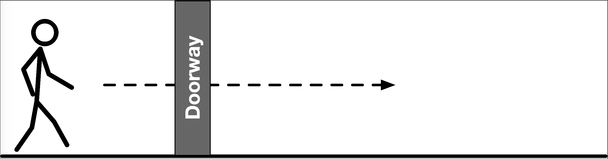
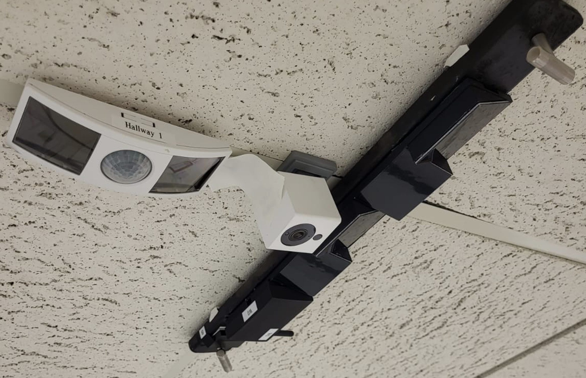
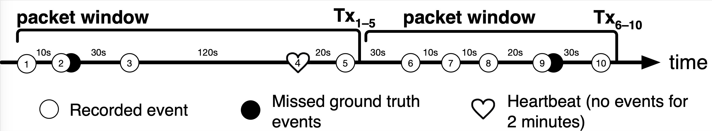
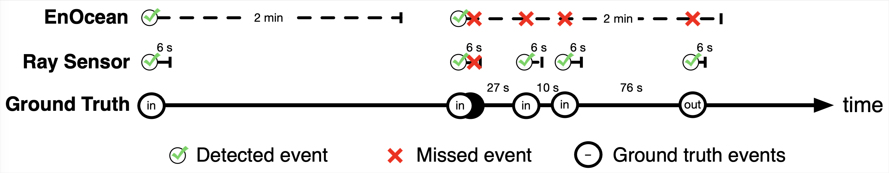

# Review_Materials

This folder contains some of the additional artifact information for the working sensor including a Video Demo (.mp4) and a sampling of the data collected from both the controlled and uncontrolled experiments of the paper. 

## Controlled Tests
<table style="width: 100%; border-collapse: collapse;">
  <tr>
    <td style="width: 100%; text-align: center;">
      
       
      <strong>Testing the Sensor: Controlled</strong>
    </td>
  </tr>
</table>
For the controlled experiments we collected data manually with the sensor sending out a single packet after each detected event.  We asked a subject to walk through the passageway where we would record the direction classified by out sensor in the column for the ground truth of the sensor as you can see in some of the samples provided in controlled_data_samples.pdf.  Most of the recordings were pretty straight forward, but occasionally other people (not affiliated with the experiment) would traverse the hallway or near the doorway and would trigger the sensor.  When this occurred, we marked that at a clobbered packet, discounted that info as it was not part of the control, and requested the subject to do another clean run to make up for the clobbered test.  This file shows that our sensor did well at detecting all of the events but occasionally classified them incorrectly.

## Video Demo

<video width="320" height="240" controls>
  <source src="SensorDemo.mp4" type="video/mp4">
</video>

The Video Demo showcases the Ray sensor operating during a range of activities. These include people walking through doorways under the sensor, pass-by events where a person walks near the sensor but does not pass under it, and confounding cases like lingering and many people walking in a tight group. We also demonstrate in the video a comparison between the sensor and the commercially available EnOcean sensor (a batteryless PIR-based occupancy sensor), showing that Ray is able to more accurately estimate the number of people during higher traffic conditions.

## Uncontrolled Deployment

<table style="width: 100%; border-collapse: collapse;">
  <tr>
    <td style="width: 100%; text-align: center;">
      
       
      <strong>Deployment Setup</strong>
    </td>
  </tr>
</table>

Due to the nature of this project, much of the data gathering and ground truth labeling required manual intervention and processing to account for the amount of corner cases and fuzzy timing between two different sensors and ground truth. A sampling of the manual data gathering for the controlled and uncontrolled experiments has been provided and the resulting excel files for the uncontrolled experiments are provided for review. There are no scripts to run, table data for the uncontrolled experiments (Tables 5 and 6) came directly from excel formulas in the excel files for each location.

### Ground Truth
Ground truth was captured by an off the shelf Wyze camera that was constantly powered and capturing data.  Video was collected, processed to pull out any frames with movement, and then manually labeled.  The field of view was different for the camera than for either sensor and with reliable power had a more accurate sense of time.  This made matching up our sensor data and commercial sensor data to compare a bit of a manual process as well.

### Our Sensor vs Ground Truth
<table style="width: 100%; border-collapse: collapse;">
  <tr>
    <td style="width: 100%; text-align: center;">
      
       
      <strong>Example Sensor Event Timeline</strong>
    </td>
  </tr>
</table>

### Our Sensor vs Commercial Sensor (EnOcean)

<table style="width: 100%; border-collapse: collapse;">
  <tr>
    <td style="width: 100%; text-align: center;">
      
       
      <strong>Example Sensor Comparison Timeline</strong>
    </td>
  </tr>
</table>